# BD Product Sheet Editor Pro

📊 **Avansert spreadsheet-editor for WooCommerce produkter, kategorier og merker**

**Versjon:** 2.2.0
**Sist oppdatert:** 8. august 2025
**WordPress kompatibilitet:** 5.0 - 6.4+
**PHP krav:** 7.4+

## 🚀 Funksjoner

- **Produktredigering**: Rediger produktnavn, priser, SKU, lager og kategorier direkte i tabellformat
- **Kategorihåndtering**: Administrer produktkategorier og deres hierarki
- **Moderne design**: Følger BD Design Guide v3.0 med gradients og responsiv layout
- **Automatisk lagring**: Endringer lagres automatisk når du redigerer
- **GitHub-basert oppdatering**: Automatiske oppdateringer via GitHub releases med forbedret stabilitet
- **Produksjonsklart**: Optimalisert for produksjonsmiljøer med proper caching og feilhåndtering

## 📋 Systemkrav

- WordPress 5.0 eller nyere
- WooCommerce plugin aktivert
- PHP 7.4 eller nyere
- Tillatelse til å administrere WooCommerce.

## 🔧 Installasjon

### Manuell installasjon

1. Last ned den nyeste versjonen fra [GitHub Releases](https://github.com/buenedata/bd-product-sheet-editor/releases)
2. Gå til WordPress Admin → Plugins → Legg til ny → Last opp plugin
3. Velg ZIP-filen og installer
4. Aktiver pluginen

### Via GitHub

```bash
cd wp-content/plugins/
git clone https://github.com/buenedata/bd-product-sheet-editor.git
```

## 🎯 Bruk

1. Gå til **Buene Data → Product Sheet Editor** i WordPress admin
2. Velg fanen du vil redigere (Produkter, Kategorier, eller Merker)
3. Rediger verdier direkte i tabellen
4. Endringer lagres automatisk

## 🔄 Automatisk Oppdatering

Denne pluginen støtter automatisk oppdatering via GitHub med forbedret stabilitet:

### Nye forbedringer i v2.2.0
- **Forbedret plugin slug detection**: Bruker repository navn i stedet for directory navn
- **Bedre update check logikk**: Proper validering og feilhåndtering
- **API caching**: 12-timers cache for GitHub API kall
- **Debug logging**: Omfattende logging for feilsøking
- **Produksjonsoptimalisering**: Renset opp development filer

### For utviklere

1. **Push endringer** til GitHub via GitHub Desktop
2. **Oppdater versjonsnummer** i plugin-headeren
3. **GitHub Actions** lager automatisk en ny release
4. **WordPress** viser oppdateringsnotifikasjon
5. **Brukere** kan oppdatere med ett klikk

### Workflow

```mermaid
graph TD
    A[Push til GitHub] --> B[GitHub Actions]
    B --> C[Auto-lag Release]
    C --> D[WordPress sjekker oppdateringer]
    D --> E[Bruker får notifikasjon]
    E --> F[Ett-klikks oppdatering]
```



## 🏗️ Arkitektur

### Filstruktur

```
bd-product-sheet-editor/
├── .github/
│   └── workflows/
│       └── release.yml              # GitHub Actions workflow
├── assets/
│   ├── css/
│   │   └── admin.css               # BD Design Guide v3.0 styling
│   └── js/
│       └── admin.js                # Modern JavaScript functionality
├── includes/
│   ├── class-bd-updater.php       # WordPress update integration
│   └── class-bd-update-server.php # Update server endpoints
├── bd-menu-helper.php              # BD menu system
├── bd-product-sheet-editor-pro.php # Hovedplugin-fil
├── BD-Plugin-Design-Guide.txt     # Design guide template
├── BD-GitHub-Update-System-Guide.txt # Update system guide
└── README.md                       # Denne filen
```

### Komponenter

#### 1. BD Menu Helper
- Samler alle BD plugins under én hovedmeny
- Automatisk plugin-oppdagelse
- Konsistent branding

#### 2. Update System
- **BD_Plugin_Updater**: WordPress update integration
- **BD_Update_Server**: REST API endpoints for update-sjekk
- **GitHub Actions**: Automatisk release-generering

#### 3. Modern UI
- BD Design Guide v3.0 compliance
- Gradient themes og moderne styling
- Responsiv design
- Accessibility support

## 🔌 API Endpoints

### Update Check
```
GET /wp-json/bd/v1/update-check/{plugin}?version={current_version}
```

### Plugin Info
```
GET /wp-json/bd/v1/plugin-info/{plugin}
```

## 🎨 Design System

Pluginen følger **BD Design Guide v3.0** med:

- **Gradient themes**: `linear-gradient(135deg, #667eea 0%, #764ba2 100%)`
- **Modern typography**: System fonts med gradient text effects
- **Card-based layout**: Hover effects og shadows
- **Responsive design**: Mobile-first approach
- **Accessibility**: WCAG 2.1 compliance

## 🔧 Utvikling

### Lokal utvikling

1. Klon repository
2. Installer i WordPress testmiljø
3. Aktiver WooCommerce
4. Test funksjonalitet

### Bidra til prosjektet

1. Fork repository
2. Opprett feature branch
3. Gjør endringer
4. Test grundig
5. Opprett Pull Request

### Versjonering

Vi bruker [Semantic Versioning](https://semver.org/):

- **MAJOR**: Breaking changes
- **MINOR**: Nye funksjoner (bakoverkompatible)
- **PATCH**: Bugfixes

### Commit Messages

- `feat: ny funksjonalitet` (minor bump)
- `fix: bugfix` (patch bump)
- `BREAKING CHANGE: endring som bryter kompatibilitet` (major bump)

## 🧪 Testing

### Manuell testing

1. Test alle CRUD-operasjoner
2. Verifiser responsiv design
3. Test på forskjellige nettlesere
4. Sjekk accessibility

### Automatisk testing

GitHub Actions kjører automatisk testing ved:
- Push til main branch
- Pull requests
- Release creation

## 🚀 Deployment

### Automatisk deployment

1. **Oppdater versjon** i `bd-product-sheet-editor-pro.php`
2. **Commit og push** endringer
3. **GitHub Actions** lager automatisk release
4. **ZIP-fil** blir tilgjengelig for nedlasting

### Manuell deployment

1. Opprett ZIP-fil av plugin-mappen
2. Ekskluder utviklingsfiler (.git, node_modules, etc.)
3. Last opp til WordPress

## 📊 Monitorering

### Metrics

- Download-statistikk fra GitHub Releases
- WordPress update success rate
- User feedback og issues

### Logging

Pluginen logger viktige hendelser:
- Update checks
- AJAX requests
- Error conditions

## 🔒 Sikkerhet

### Beste praksis

- **Nonce verification** for alle AJAX requests
- **Capability checks** for admin functions
- **Input sanitization** og validation
- **Secure file handling**

### Update Security

- HTTPS for alle API calls
- Signature verification (planlagt)
- Rollback functionality (planlagt)

## 🆘 Feilsøking

### Vanlige problemer

#### Oppdateringer fungerer ikke
1. Sjekk at GitHub repository er offentlig
2. Verifiser at releases blir opprettet
3. Kontroller WordPress permissions

#### Styling ser feil ut
1. Sjekk at CSS-filen lastes
2. Verifiser at det ikke er konflikter med andre plugins
3. Test med standard WordPress theme

#### AJAX-feil
1. Sjekk browser console for JavaScript errors
2. Verifiser nonce og permissions
3. Test med WordPress debug aktivert

### Debug Mode

Aktiver WordPress debug:

```php
define('WP_DEBUG', true);
define('WP_DEBUG_LOG', true);
```

Sjekk `/wp-content/debug.log` for feilmeldinger.

## 📞 Support

### Kontakt

- **Email**: support@buenedata.no
- **Website**: [buenedata.no](https://buenedata.no)
- **GitHub Issues**: [GitHub Repository](https://github.com/buenedata/bd-product-sheet-editor/issues)

### Dokumentasjon

- [BD Plugin Design Guide](BD-Plugin-Design-Guide.txt)
- [BD GitHub Update System Guide](BD-GitHub-Update-System-Guide.txt)
- [WordPress Plugin Development](https://developer.wordpress.org/plugins/)

## 📄 Lisens

Dette prosjektet er lisensiert under GPL v2 eller senere.

## 🙏 Takk til

- WordPress community
- WooCommerce team
- GitHub Actions team
- Alle bidragsytere

## 📝 Changelog

### v2.2.0 (8. august 2025)
- **🔧 Kritiske rettelser for WordPress update notifications**
- **✅ Fikset plugin slug detection** - Bruker repository navn i stedet for directory navn
- **🚀 Forbedret update check logikk** - Proper validering og feilhåndtering
- **⚡ Implementert API caching** - 12-timers cache for GitHub API kall med transients
- **🐛 Lagt til omfattende debug logging** - For bedre feilsøking og monitorering
- **📦 Produksjonsoptimalisering** - Oppdatert .gitignore og fjernet development filer
- **🔒 Forbedret sikkerhet** - Bedre input validering og error handling

### v2.1.4 (tidligere)
- Grunnleggende GitHub update system implementering
- WordPress update integration
- BD Design Guide v3.0 styling
- Automatisk lagring funksjonalitet

---

**Buene Data** - Profesjonelle WordPress-verktøy for moderne byrå og nettsteder

🌐 [buenedata.no](https://buenedata.no) | 📧 [support@buenedata.no](mailto:support@buenedata.no) | 🐙 [GitHub](https://github.com/buenedata)